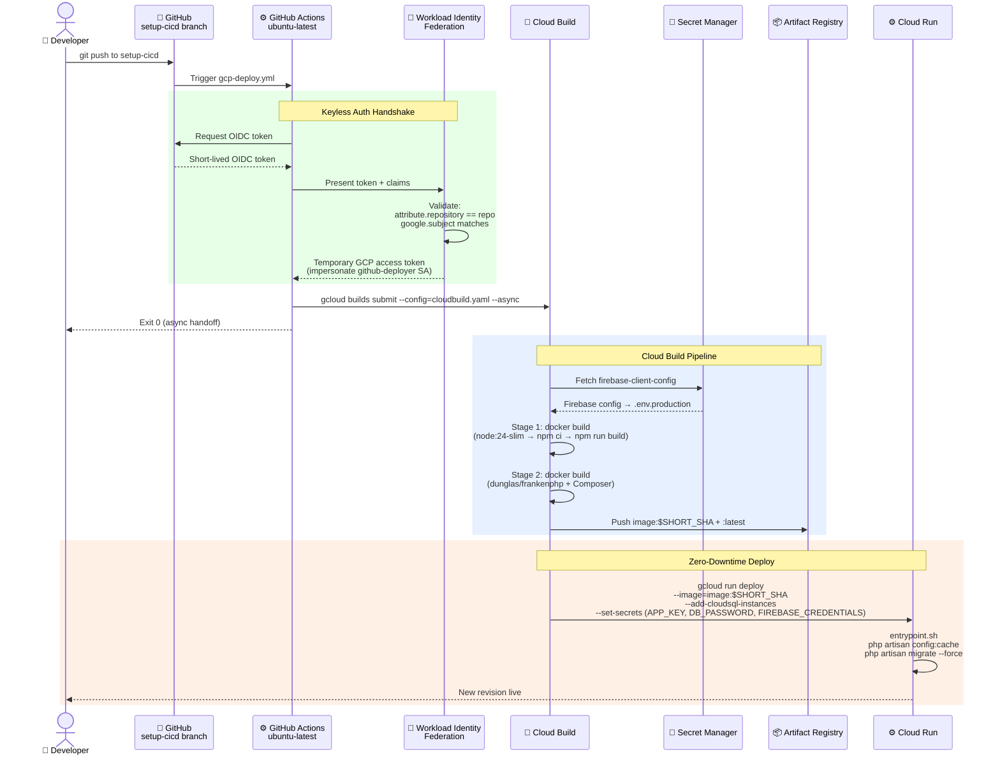
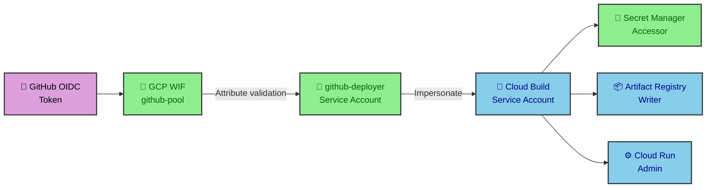

# CI/CD Pipeline — Manajemen Gudang

## Pipeline Overview



## End-to-End Deploy Sequence (Detailed)

```mermaid
flowchart TD
    A[👤 Push to setup-cicd] --> B{🐙 GitHub Actions<br/>Triggered?}
    B -->|Yes| C[📥 Checkout code<br/>actions/checkout@v4]
    C --> D[🔐 Auth to GCP<br/>google-github-actions/auth@v2]
    D --> E[⚙️ Setup gcloud CLI<br/>google-github-actions/setup-gcloud@v2]
    E --> F[📤 gcloud builds submit<br/>--async]
    F --> G{✅ GitHub Job<br/>Complete}

    F --> H[🔨 Cloud Build: fetch-build-secrets]
    H --> I[🔑 Pull firebase-client-config<br/>from Secret Manager]
    I --> J[📝 Write .env.production]

    J --> K[🐳 Cloud Build: build]
    K --> L[Stage 1: node:24-slim<br/>npm ci → npm run build<br/>Vite 8 + Tailwind 4]
    L --> M[Stage 2: dunglas/frankenphp<br/>composer install --no-dev<br/>Copy compiled assets]

    M --> N[📦 Cloud Build: push<br/>→ Artifact Registry]
    N --> O[🏷️ Tag: $SHORT_SHA + latest]

    O --> P[🚀 Cloud Build: deploy]
    P --> Q[Cloud Run deploy<br/>--add-cloudsql-instances<br/>--set-env-vars<br/>--set-secrets]
    Q --> R[entrypoint.sh runs]

    R --> S[⚙️ config:cache]
    S --> T[🗄️ migrate --force]
    T --> U[🔗 storage:link]
    U --> V[✅ New revision serving<br/>at gudang.tech]

    classDef trigger fill:#DDA0DD,stroke:#333,stroke-width:2px,color:black
    classDef gha fill:#FFD700,stroke:#333,stroke-width:2px,color:black
    classDef build fill:#87CEEB,stroke:#333,stroke-width:2px,color:darkblue
    classDef secrets fill:#90EE90,stroke:#333,stroke-width:2px,color:darkgreen
    classDef deploy fill:#FFB6C1,stroke:#DC143C,stroke-width:2px,color:black
    classDef done fill:#98FB98,stroke:#006400,stroke-width:2px,color:darkgreen

    class A,B,G trigger
    class C,D,E,F gha
    class H,J,K,L,M,N,O build
    class I secrets
    class P,Q,R,S,T,U deploy
    class V done
```



## Key Files

### `.github/workflows/gcp-deploy.yml`

```yaml
on:
  push:
    branches: [setup-cicd]
```

| Step | Action | Purpose |
|------|--------|---------|
| Checkout | `actions/checkout@v4` | Pull source code |
| Auth | `google-github-actions/auth@v2` | WIF keyless OIDC exchange |
| Setup gcloud | `google-github-actions/setup-gcloud@v2` | Configure gcloud CLI |
| Build Submit | `gcloud builds submit --config=cloudbuild.yaml --async` | Trigger Cloud Build, exit immediately |

### `cloudbuild.yaml`

```yaml
steps:
  - id: fetch-build-secrets    # Pull firebase-client-config → .env.production
  - id: build                  # docker build (multi-stage)
  - id: push                   # Push image:$SHORT_SHA
  - id: push-latest            # Push image:latest
  - id: deploy                 # gcloud run deploy with all flags
```

**Substitutions:**

| Variable | Value |
|----------|-------|
| `_SERVICE_NAME` | `manajemen-gudang` |
| `_REGION` | `asia-southeast2` |
| `_ARTIFACT_REGISTRY_REPO` | `${_REGION}-docker.pkg.dev/${PROJECT_ID}/cloud-run` |
| `_MEMORY` | `512Mi` |
| `_CPU` | `1` |
| `_MIN_INSTANCES` | `0` |
| `_MAX_INSTANCES` | `10` |
| `_CONCURRENCY` | `80` |
| `_TIMEOUT` | `300s` |
| `_SERVICE_ACCOUNT` | (empty — uses compute default) |
| `_DB_INSTANCE_NAME` | `warehouse-db` |

### `Dockerfile` — Multi-stage Build

| Stage | Base Image | Actions |
|-------|-----------|---------|
| Frontend | `node:24-slim` | `npm ci --ignore-scripts` → `npm run build` → output to `public/build` |
| Production | `dunglas/frankenphp:latest` | `install-php-extensions pdo_mysql gd zip` → `composer install --no-dev` → copy frontend assets → set entrypoint |

### `docker/entrypoint.sh`

```sh
php artisan config:cache     # Freeze config for runtime speed
php artisan migrate --force  # Apply pending DB migrations
php artisan storage:link     # Symlink storage → public (idempotent)
exec "$@"                    # Hand off to FrankenPHP
```

## Auth Chain



## Deployment Environment Variables

Set at deploy time via `cloudbuild.yaml` `--set-env-vars`:

```
APP_ENV=production
APP_DEBUG=false
APP_URL=https://gudang.tech
DB_CONNECTION=mysql
DB_SOCKET=/cloudsql/${PROJECT_ID}:${_REGION}:${_DB_INSTANCE_NAME}
```

Set at deploy time via `--set-secrets` (from Secret Manager):

```
APP_KEY=app-key:latest
DB_PASSWORD=db-password:latest
FIREBASE_CREDENTIALS=firebase-credentials:latest
```

Build-time only (injected by `fetch-build-secrets` step → `Dockerfile` Stage 1):

```
.env.production → VITE_FIREBASE_API_KEY, VITE_FIREBASE_AUTH_DOMAIN, ...
```

## Async Build Rationale

`--async` flag on `gcloud builds submit` is **critical**. Without it:

1. GitHub Actions runner waits for Cloud Build logs stream
2. Runner's service account lacks `storage.objects.get` on GCP's default build logs bucket
3. Results in **Exit Code 1** — pipeline fails despite successful build

With `--async`, the runner hands off tracking to GCP and exits immediately (Exit Code 0).

## Resolved Pipeline Issues

| Issue | Root Cause | Fix |
|-------|-----------|-----|
| WIF Provider Error 400 | Attribute condition references unmapped claims | Map `google.subject`, `attribute.repository`, `attribute.repository_owner` before using in CEL expression |
| Build logs stream Error (Exit 1) | Service account lacks default bucket read permissions | Added `--async` flag to `gcloud builds submit` |
| Cloud SQL instance string malformed | Nested path names in substitutions | Isolated `_DB_INSTANCE_NAME` for `--add-cloudsql-instances`; use full path for `--set-env-vars` |
