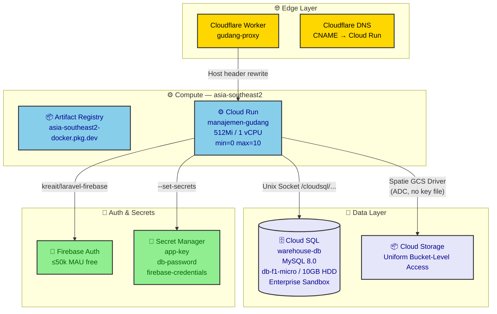
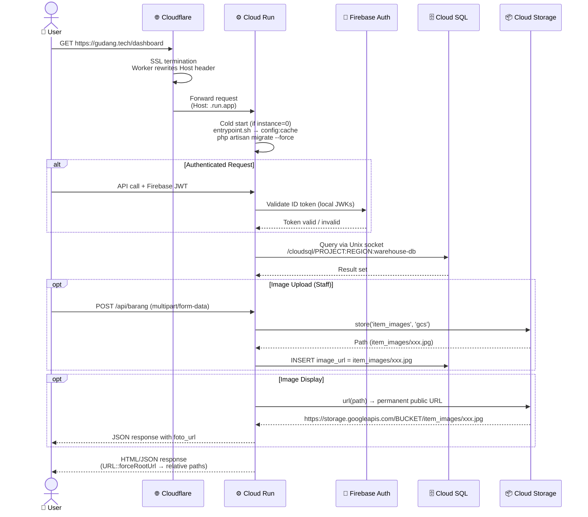

# Cloud Infrastructure — Manajemen Gudang

## System Architecture

```mermaid
flowchart TB
    User[👤 User<br/>gudang.tech] --> CF[🌐 Cloudflare<br/>DNS + SSL + Worker Proxy]

    CF -->|HTTPS| CR[⚙️ Cloud Run<br/>asia-southeast2<br/>FrankenPHP + Laravel Octane<br/>0→10 instances]

    CR -->|Unix Socket<br/>TLS Encrypted| SQL[(🗄️ Cloud SQL<br/>MySQL 8.0<br/>db-f1-micro<br/>asia-southeast2)]

    CR -->|Store + Public URL| GCS[📦 Cloud Storage<br/>UBLA Bucket<br/>US Region<br/>Public Read via allUsers]

    CR -->|Token Validation<br/>JWKs| FAuth[🔐 Firebase Auth<br/>Client-side SDK<br/>Stateless JWT]

    CR -->|@runtime| SM[🔑 Secret Manager<br/>APP_KEY<br/>DB_PASSWORD<br/>FIREBASE_CREDENTIALS]

    classDef edge fill:#FFD700,stroke:#333,stroke-width:2px,color:black
    classDef compute fill:#87CEEB,stroke:#333,stroke-width:2px,color:darkblue
    classDef storage fill:#E6E6FA,stroke:#333,stroke-width:2px,color:darkblue
    classDef security fill:#90EE90,stroke:#333,stroke-width:2px,color:darkgreen
    classDef user fill:#DDA0DD,stroke:#333,stroke-width:2px,color:black

    class User user
    class CF edge
    class CR compute
    class SQL,GCS storage
    class FAuth,SM security
```

## GCP Deployment Topology



## User Request Flow (Sequence)



## Component Specifications

| Component | Spec | Cost |
|-----------|------|------|
| **Cloud Run** | 512Mi RAM, 1 vCPU, min=0, max=10, concurrency=80, timeout=300s | $0.00 (Always Free: 2M req/mo) |
| **Cloud SQL** | MySQL 8.0, db-f1-micro, 10GB HDD, Enterprise Sandbox, Single Zone | ~$12.25/mo (trial credit) |
| **GCS Bucket** | UBLA, US region, public read per-object only (`allUsers` → `Storage Legacy Object Reader` — no listing), 5GB/mo free tier | $0.00 |
| **Firebase Auth** | ≤50k MAU, client-side SDK + stateless backend | $0.00 |
| **Secret Manager** | 3 active secrets (app-key, db-password, firebase-credentials) | $0.00 (6 free) |
| **Artifact Registry** | asia-southeast2 region | Minimal ($0.10/GB storage) |
| **Cloudflare** | DNS + Worker (gudang-proxy) + SSL (Full mode) | $0.00 (free plan) |

## Network & Security

- **Cloud SQL:** No public IP, no authorized external networks. Access exclusively via Cloud SQL Auth Proxy over local Unix socket (`/cloudsql/...`). Connection encrypted with TLS, IAM-verified.
- **Cloudflare:** SSL/TLS mode set to `Full`. CNAME records proxied (orange cloud) to `manajemen-gudang-1071098053707.asia-southeast2.run.app`.
- **Cloud Run:** `--allow-unauthenticated` (public web app). Firebase JWT validation is stateless — tokens verified locally using Google's public JWKs.
- **AppServiceProvider:** Forces `URL::forceRootUrl` + `URL::forceScheme('https')` in production to prevent cross-origin asset blocking when accessed via custom domain.
- **Secrets:** Never stored in `.env` files or Git. Injected at deploy time via Cloud Run `--set-secrets` flag from Secret Manager.

## Docker Container

**Base image:** `dunglas/frankenphp:latest`
**PHP extensions:** `pdo_mysql`, `gd`, `zip`
**Entrypoint:** `docker/entrypoint.sh` — caches config, runs migrations, starts FrankenPHP
**Port:** `8080`
**Memory leak protection:** `MAX_REQUESTS=500` (Octane worker recycling)

### Multi-stage Build (`Dockerfile`)

| Stage | Base | Purpose |
|-------|------|---------|
| Frontend | `node:24-slim` | `npm ci --ignore-scripts` → `npm run build` (Vite 8 + Tailwind 4) |
| Production | `dunglas/frankenphp:latest` | Composer install (--no-dev), copy compiled assets, set up FrankenPHP worker |

### Local Development (`docker-compose.yml`)

Mirrors production with MySQL 8.0 sidecar on port 3307, app on port 8080. Health check on MySQL ensures app starts after DB is ready.

## GCS Storage Integration

- **Driver:** `gcs` via `spatie/laravel-google-cloud-storage` (Spatie GCS driver)
- **Auth:** Application Default Credentials (ADC) — no JSON key file. Cloud Run service account (`Storage Object Admin`) authenticates automatically.
- **Env vars in production:**
  - `FILESYSTEM_DISK=gcs` (set via `cloudbuild.yaml` `--set-env-vars`)
  - `GOOGLE_CLOUD_PROJECT_ID` (from Secret Manager `gcs-project-id`)
  - `GOOGLE_CLOUD_STORAGE_BUCKET` (from Secret Manager `gcs-bucket`)
- **URL strategy:** `Storage::disk('gcs')->url($path)` returns permanent public `https://storage.googleapis.com/BUCKET/path` URLs. No signed URLs — images are master data, cached by Cloudflare.
- **Bucket permission:** Required: `allUsers` granted `Storage Legacy Object Reader` (`roles/storage.legacyObjectReader`) at bucket level. This allows reading individual files but blocks directory listing (no XML index). Without this, public URLs return 403.
- **Path format stored in DB:** Raw GCS path e.g. `item_images/abc123.jpg` (not full URL). The URL is generated at response time via `transform()`.

## Resolved Issues

1. **PHP 8.4 requirement** — Transitive dependencies (symfony/error-handler ^8.0) hard-require PHP 8.4 despite Laravel 13 listing 8.3 as minimum.
2. **CORS/asset blocking** — Fixed via `URL::forceRootUrl` + `URL::forceScheme` in `AppServiceProvider.php:23-27`.
3. **Cloud SQL instance string malformation** — Isolated `_DB_INSTANCE_NAME` substitution for `--add-cloudsql-instances` vs `--set-env-vars`.
4. **GCP logs stream error** — Resolved with `--async` flag in GitHub Actions workflow.
5. **WIF Provider Error 400** — Attribute mappings must be declared before condition evaluation in GCP Workload Identity Federation.
6. **Files lost on deploy** — Controller used `Storage::disk('public')` (Cloud Run ephemeral disk). Switched to `Storage::disk('gcs')` with permanent public URLs.
